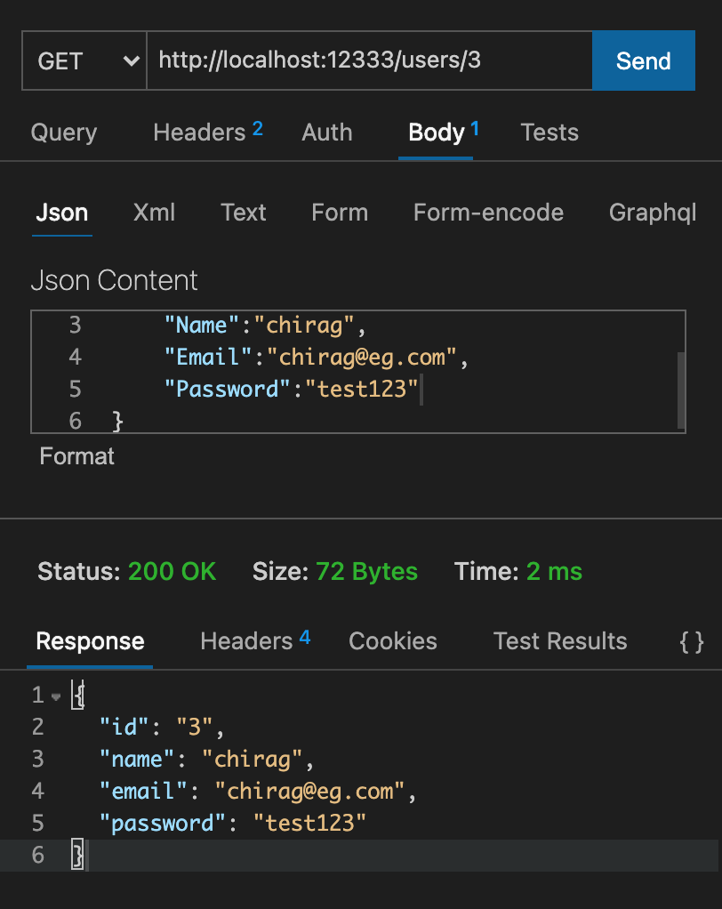

# INSTA-API

> Chirag Ganguli | Created: 8th October, 2021
 
> Last Updated: 9th October, 2021

  

## Description

Minimalist Backened API Implementation using User & Posts attributes.
 
Made using GOLANG & MONGODB
 
MongoDB is used locally in MongoDB default docker container

  

### NOTE:

This is made purely as part of research and implementation & thus will be updated and modified with new features to make it upto the market standards. 
 
Currently, there is minimal design improvements & security.

  

